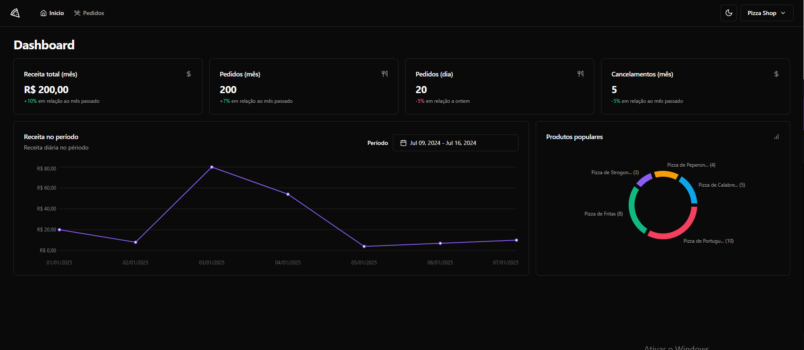
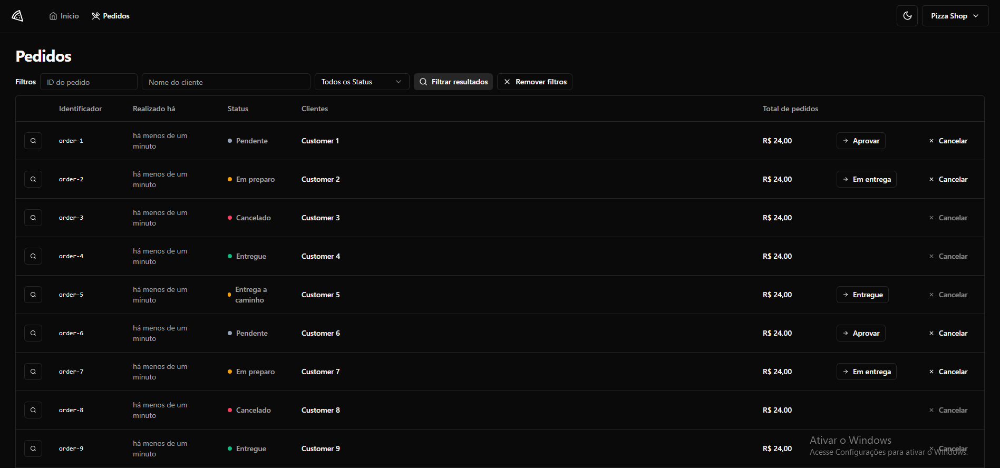
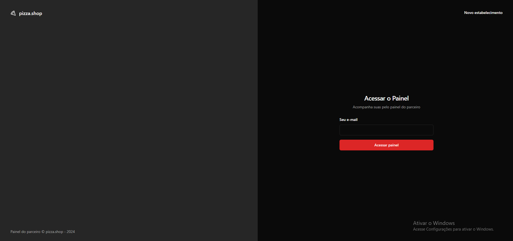
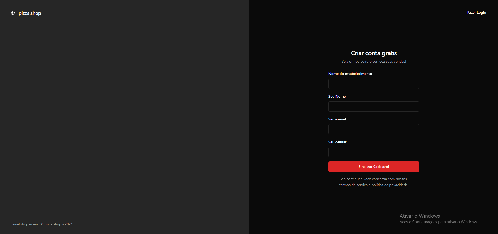

# Pages Dashboard 🍕🔥

> Dashboard '/'


> Orders '/orders'


> SignIn '/sign-in'


> SignUp '/sign-up'



# About the system dashboard features 🍕🔥 

- Food Dashboards Data Management:
  > The application manages all data related to food dashboards, offering a complete overview
- Order Flow:
  > Monitors and manages the flow of orders, from entry to delivery.
- Order Status:
  > Displays the current status of orders, allowing real-time tracking.
- Popular Product Metrics:
  > Provides metrics to identify which products are most popular with customers.
- Analysis of Least Sold Items:
  > Identifies which items sold the least, helping to optimize inventory and sales strategies.
- Sales Percentage:
  > Calculates the percentage of sales for different periods, such as day, month, etc., allowing a detailed analysis of sales performance.

## Tools Using ⚙ 🔥

- React
- Typescript
- RadixUi - to components
- Lucide - to icons
- Tailwindcss - to styles
- Vite - to create template app react
- Vitest - to carry out tests
- MSW - to using with mocks
- Zod - 
- Axios - to communication Api
- Playwright - to simulate all functionality application in tests:e2e

## Running Application 🚀🔥

- First install api to running application 
  > https://github.com/Alessandro0003/dashboarding-api
- Follow steps to run the application successfully
>

#### Install project dependencies 📦
````bash
 $ pnpm install
````
>
#### After follow steps above open your projects and start server of both

- Server running dashboard 

````bash
  $ pnpm run dev 
````

- Server running mock

````bash
  $ pnpm run dev:test
````

- Running Test E2E with Playwright

````bash
  $ pnpm run test:e2e
````

#### Others commands where in package.json 📦